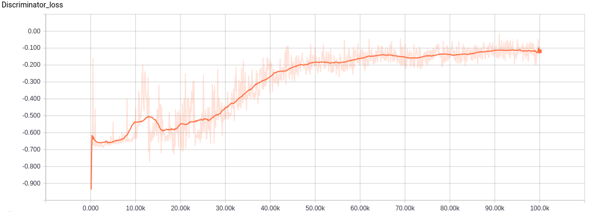
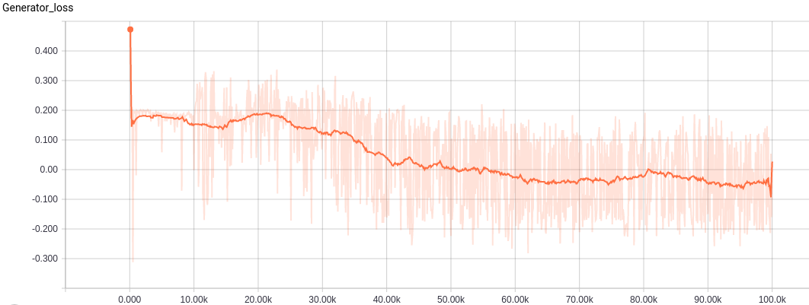

# WassersteinGAN.tensorflow
Tensorflow implementation of Arjovsky et al.'s [Wasserstein GAN](https://arxiv.org/abs/1701.07875)

1. [Prerequisites](#prerequisites)
2. [Results](#results)
3. [Observations](#observations)
4. [References and related links](#references-and-related-links)

:exclamation:  Readme still under edit. :exclamation:

## Prerequisites
- Code was tested in Linux system with Titan GPU. 
- Model was trained with tensorflow v0.11 and python2.7. Newer versions of tensorflow requires updating the summary statements to avoid depreceated warnings.
- CelebA dataset should be downloaded and unzipped manually. [Download link](https://www.dropbox.com/sh/8oqt9vytwxb3s4r/AADIKlz8PR9zr6Y20qbkunrba/Img/img_align_celeba.zip)
- Default arguments to **main.py** runs GAN with cross entropy objective.
- **run_main.sh** has command to run Wasserstein GAN model.

## Results
- Random sample of images generated after training GAN with wasserstein distance for 1e5 itrs, lr=5e-5, RMSPropOptimizer.

  For comparison: Random sample of images generated using GAN with cross entropy objective for 2e4 itrs, lr=2e-4, AdamOptimizer.

- Discriminator loss for Wasserstein GAN. Note that the original paper plots the discriminator loss with a negative sign, hence the flip in the direction of the plot.

- Generator loss for Wasserstien GAN. 

- Weight clipping on discriminator weights to maintain lipschitz bound and continuity in discriminator.

## Observations
---

## References and related links
- Pytorch implementation of WasserstienGAN by authors of the paper - [link](https://github.com/martinarjovsky/WassersteinGAN)
- Interesting discussion on r/machinelearning - [link](https://www.reddit.com/r/MachineLearning/comments/5qxoaz/r_170107875_wasserstein_gan/)
